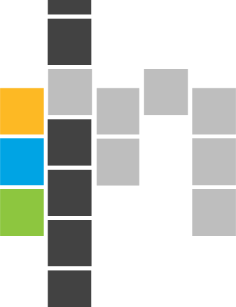

<a href="#"></a>

# Mosaic

[](https://badge.fury.io/js/%40simpleview%2Fsv-mosaic)

```
npm install @simpleview/sv-mosaic
```

Mosaic is a [React](https://reactjs.org/) user interface library designed to create admin interfaces. It is product-agnostic and can be used in any manner of admin UI.

It is built on top of [React Material UI](https://mui.com/). Pin your app to the same MUI (and other peer dependency) versions that Mosaic declares.

Storybook: [https://simpleviewinc.github.io/sv-mosaic/](https://simpleviewinc.github.io/sv-mosaic/)

---

## Usage

- Add `@simpleview/sv-mosaic` to your `package.json` and pin to a specific version.
- Mosaic declares `peerDependencies` that are not bundled with the library. Satisfy all of them in your app — see the current list in `[packages/mosaic/package.json](packages/mosaic/package.json)`.

Import modules by specific resource path so you do not pull in the entire library:

```js
import DataView from "@simpleview/sv-mosaic/components/DataView"
```

Public entry points are defined by the `exports` map in the library `[package.json](packages/mosaic/package.json)`:

- **components** — e.g. `import DataView from "@simpleview/sv-mosaic/components/DataView"`
  - Import from the directory named after the component (not deeper into implementation files).
  - Component-specific types are available from the same path, e.g. `import DataView, { type DataViewProps } from "@simpleview/sv-mosaic/components/DataView"`
- **theme** — e.g. `import theme from "@simpleview/sv-mosaic/theme"`
- **transforms** — e.g. `import { transform_boolean } from "@simpleview/sv-mosaic/transforms"`
- **utils** — e.g. `import { getToggle } from "@simpleview/sv-mosaic/utils/toggle"`
- **constants** — e.g. `import { DATE_FORMAT_FULL } from "@simpleview/sv-mosaic/constants"`
- **mock** — e.g. `import { mockAddresses } from "@simpleview/sv-mosaic/mock"`
- **types** — e.g. `import type { MosaicLabelValue } from "@simpleview/sv-mosaic"`
  - Types are the *only* resource that should be imported from the package root.
  - The same types are also published as `@simpleview/sv-mosaic-types` for apps that need Mosaic types without installing the full library.

---

# Development Guide

This repository is a **pnpm workspace** monorepo:

| Package                                | Path                      | Role                        |
| -------------------------------------- | ------------------------- | --------------------------- |
| `@simpleview/sv-mosaic`                | `packages/mosaic`         | Published component library |
| `@simpleview/sv-mosaic-storybook`      | `packages/storybook`      | Storybook docs app          |
| `@simpleview/sv-mosaic-consumer-tests` | `packages/consumer-tests` | Export / types smoke tests  |
| `@simpleview/sv-mosaic-e2e`            | `packages/e2e`            | Playwright e2e tests        |

## Development setup

Developers should use [sv-kubernetes](https://github.com/simpleviewinc/sv-kubernetes) and keep this repo on the **WSL filesystem** (not a Windows-mounted path). That avoids filesystem and tooling friction when working with Docker and Node.

```
sudo sv install sv-mosaic --type=container --branch=develop
cd /sv/containers/sv-mosaic
npm run docker:dev
```

To make use of intellisense in your IDE, you will need to install activate pnpm and install packages on your host:

```
corepack enable
corepack prepare pnpm@9.15.9 --activate
pnpm install
```

You can also develop on the host if the docker variant doesn't fit your needs.

```
pnpm host:dev
```

Storybook (Docker or host) listens on port `10001`. Inside sv-kubernetes it is typically available at [http://kube.simpleview.io:10001/](http://kube.simpleview.io:10001/).

## Scripts

Root scripts are the supported developer entry points. Prefer them over calling package filters or Compose services directly.

### Docker (`docker:*`)

These build/run Compose services defined in `compose.yml`:


| Script                      | Purpose                                         |
| --------------------------- | ----------------------------------------------- |
| `npm docker:dev`            | Storybook dev server with source bind-mounts    |
| `npm docker:lint`           | Lint inside the workspace image                 |
| `npm docker:test:unit`      | Unit tests inside Docker                        |
| `npm docker:test:consumer`  | Consumer typechecks inside Docker               |
| `npm docker:test:e2e`       | Playwright e2e against a served Storybook build |

### Host (`host:*`)

You'll need `pnpm` installed on your host in order to use the following scripts. After `pnpm install` on the host (or in another non-Docker environment):

| Script                    | Purpose                                                  |
| ------------------------- | -------------------------------------------------------- |
| `pnpm host:dev`           | Build mosaic ESM once, then watch mosaic + run Storybook |
| `pnpm host:build`         | Build mosaic (ESM + CJS) and Storybook static output     |
| `pnpm host:lint`          | Lint packages that define a lint script                  |
| `pnpm host:test:unit`     | Run mosaic unit tests (Vitest)                           |
| `pnpm host:test:consumer` | Typecheck consumer smoke imports (CJS + ESM)             |
| `pnpm host:test:e2e`      | Build mosaic, then run Playwright Chromium e2e tests     |
| `pnpm release`            | Bump / release `@simpleview/sv-mosaic` via `release-it`  |

## Component file structure

Component directories under `packages/mosaic/src/components` should follow this structure:

- `/components/` — each exported component has its own sub-folder
  - `[Component]` — e.g. `DataView`, `DataViewFilterDate`
    - `index.ts`
      - Re-export the primary component as default (e.g. from `/DataViewFilterDate/DataViewFilterDate.tsx`).
      - Re-export entities from `[ComponentTypes].ts` so types are usable in-repo and by consumers.
    - `[Component].tsx` — primary component file
    - `[ComponentTypes].ts` — component-local TypeScript interfaces/types
      - Primary props type must be named `[Component]Props` (e.g. `DataViewProps`).
      - Prefix all exported `type` / `interface` names with the component name so they stay unique across the project (e.g. `DataViewOptions`, `DataViewColumn`).
    - `[Component].styled.ts` — optional styled-components used by the component

Good examples: `Button/`, `LeftNav/`, `CheckboxList/`, `Checkbox/`.

## Publishing

Publishing to NPM and Storybook is automated by GitHub Actions (`.github/workflows/ci.yml`). You do not need to run build or publish manually in CI.

- Version bumps are performed with `pnpm release`, which runs `release-it` against `packages/mosaic` only.
- On push to `staging` or `master`, after unit, consumer, e2e, and Storybook typecheck jobs pass, Actions publishes `@simpleview/sv-mosaic` and `@simpleview/sv-mosaic-types` to NPM:
  - `master` publishes the version in `packages/mosaic/package.json` (npm `latest`).
  - `staging` publishes `{version}-staging-{sha6}` under the npm `beta` tag.
- NPM auth uses [Trusted Publishing](https://docs.npmjs.com/trusted-publishers) (OIDC). The publish job requests `id-token: write` and does **not** use an `NPM_TOKEN` repository secret. The GitHub Environment `npm-publish` is required for the publish job.
- On push to `develop`, `qa`, `staging`, or `master`, Actions also deploys Storybook static files to GitHub Pages at `https://simpleviewinc.github.io/sv-mosaic/sb8/<branch>/`.

